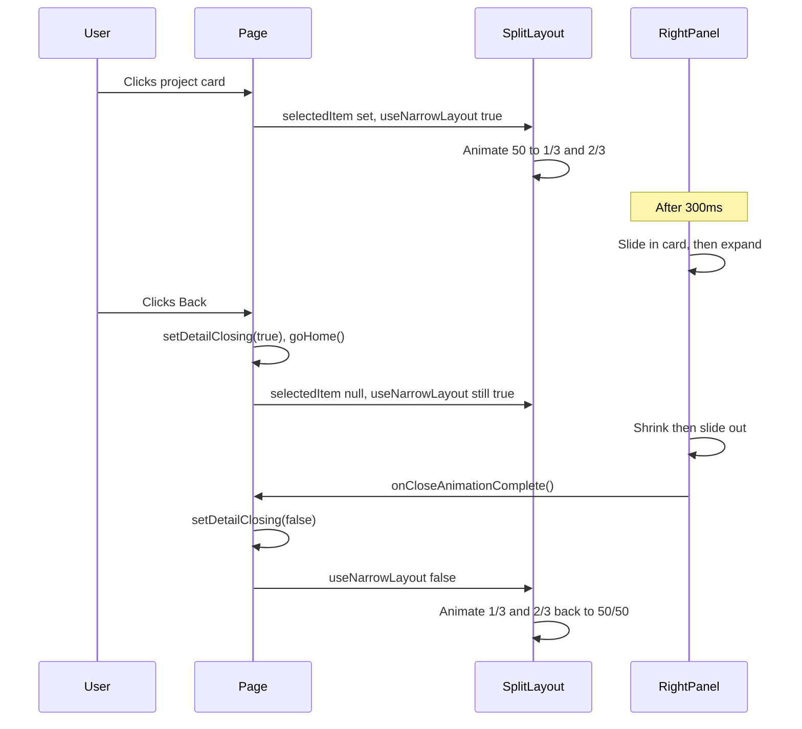

# Split ratio animation before project card/section

## Goal

When a project (or article/photography) detail is opened, the layout should first animate from **50/50** to **left 1/3, right 2/3**, then the existing card slide-in and expand should run. On close, the card exits first, then the ratio animates back to 50/50.

## Current behaviour

- [SplitLayout](components/layout/SplitLayout.tsx): Left and right panels use fixed `md:w-1/2`. Overlay width is also `md:w-1/2` when detail is open. No width transitions.
- [RightPanel](components/layout/RightPanel.tsx): On open, after 10ms the card slides in; after 300ms it expands. On close, it shrinks then slides out (300ms + 300ms), then clears `displayItem`.

## Implementation

### 1. SplitLayout: conditional widths and transition

**File:** [components/layout/SplitLayout.tsx](components/layout/SplitLayout.tsx)

- Add a prop `useNarrowLayout: boolean` (true when detail is open or detail is closing). When true: left 1/3, right 2/3; when false: 50/50.
- Left panel wrapper: replace fixed `md:w-1/2` with conditional classes, e.g. `md:w-1/2` when `!useNarrowLayout`, `md:w-1/3` when `useNarrowLayout`, and add `transition-[width] duration-300 ease-out` (or use Tailwind `transition-all` and a fixed duration from tokens).
- Right panel wrapper: same idea — `md:w-2/3` when narrow, `md:w-1/2` otherwise, same transition.
- Overlay div: when `hasDetailOpen`, width must match the left panel (so `md:w-1/3` when narrow, `md:w-1/2` when not). Use the same `useNarrowLayout` and transition so the overlay stays aligned with the left panel.

Keep `hasDetailOpen` for “show overlay” (and any other existing behaviour). Use `useNarrowLayout` only for widths and overlay width.

### 2. RightPanel: delay slide-in; notify when close animation completes

**File:** [components/layout/RightPanel.tsx](components/layout/RightPanel.tsx)

- **Opening:** Change the initial delay before setting `showDetail(true)` from `10` ms to `300` ms so the 300ms ratio animation in SplitLayout finishes first, then the card slides in. Keep the existing 300ms delay before `setIsExpanded(true)`.
- **Closing:** Add an optional prop `onCloseAnimationComplete?: () => void`. In the existing close branch of the detail `useEffect`, when you call `setDisplayItem(null)` (after the slide-out timeout), also call `onCloseAnimationComplete?.()` so the parent knows the exit animation is done.

### 3. Page: narrow layout state and wiring

**File:** [app/page.tsx](app/page.tsx)

- Add state: `const [isDetailClosing, setIsDetailClosing] = useState(false)`.
- Compute `useNarrowLayout = (selectedItem != null && currentView !== 'portrait') || isDetailClosing` and pass it to `SplitLayout` as the new prop.
- Wrap home/back behaviour so that when the user closes the detail (e.g. `goHome()` or the same handler used by Back): if a detail is currently open, set `isDetailClosing(true)` before calling `goHome()` (so `selectedItem` becomes null but layout stays narrow). Pass a callback to SplitLayout that will be forwarded to RightPanel: `onCloseAnimationComplete={() => setIsDetailClosing(false)}`.
- Ensure RightPanel receives `onCloseAnimationComplete` (via SplitLayout). So SplitLayout will need to accept `onCloseAnimationComplete` and pass it through to `RightPanel`.

### 4. SplitLayout: pass through close-complete callback

**File:** [components/layout/SplitLayout.tsx](components/layout/SplitLayout.tsx)

- Add prop `onDetailCloseComplete?: () => void` (or same name as in RightPanel: `onCloseAnimationComplete`). Pass it to `RightPanel` so that when the detail exit animation finishes, the page can clear `isDetailClosing`.

## Flow summary

## Constants

- Use a single duration for the ratio animation (e.g. 300ms) and the same value for the “delay before card slide-in” in RightPanel so they stay in sync. Prefer reading from design tokens (e.g. `duration-normal`) if available.

## Edge cases

- **Escape key / click outside:** Use the same back handler that sets `isDetailClosing(true)` and then `goHome()` so the close sequence and layout behaviour are consistent.
- **Resize / mobile:** Only apply ratio change at `md` and up; below that, keep current behaviour (no ratio animation).

## Files to change

1. [components/layout/SplitLayout.tsx](components/layout/SplitLayout.tsx) — `useNarrowLayout` prop, conditional widths + transition, overlay width, pass-through for `onDetailCloseComplete`.
2. [components/layout/RightPanel.tsx](components/layout/RightPanel.tsx) — 300ms delay before slide-in, `onCloseAnimationComplete` prop and call when exit animation finishes.
3. [app/page.tsx](app/page.tsx) — `isDetailClosing` state, `useNarrowLayout` derivation, back handler that sets `isDetailClosing(true)` then `goHome()`, and `onDetailCloseComplete` callback to clear it; pass both into SplitLayout.

